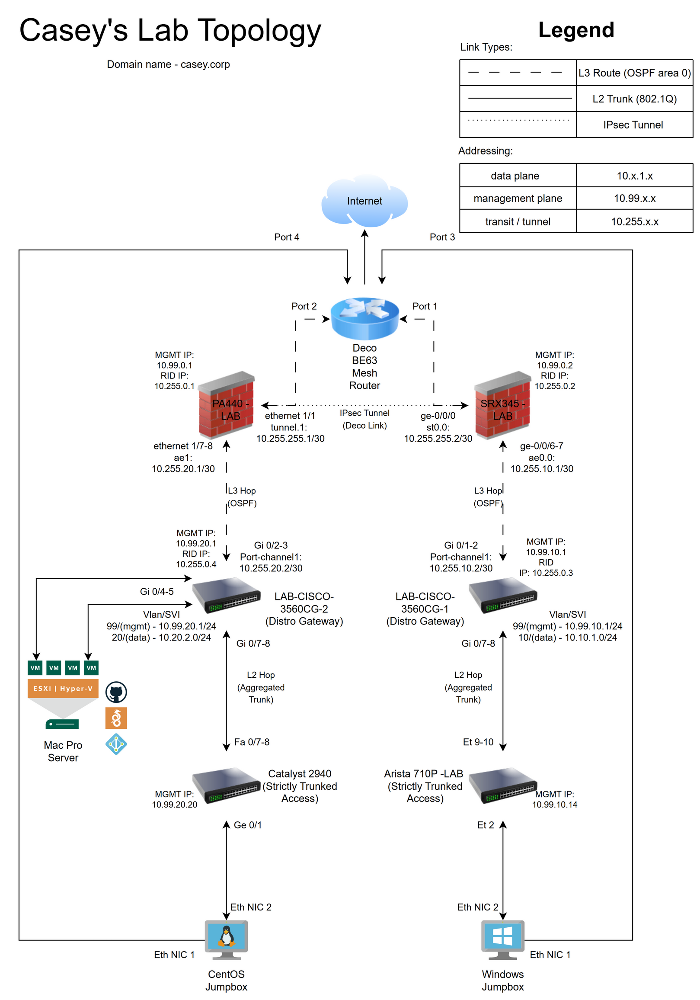

# CASEY-LAB — Dual-Site Enterprise Homelab

A dual-site enterprise network on physical hardware. Two firewalled sites joined
into a single OSPF routing domain across a route-based IKEv2 IPsec tunnel, with
separated data and management planes, aggregated uplinks, and a services layer
that grows as I build it.

Domain: `casey.corp`. Documentation here is updated as the lab changes.

Part of a set: this hub · the [profile](https://github.com/117caseyallen-NetAdm)
· and the project repos below.

*Editable source: [`CA-LAB-Topo.drawio`](topology/CA-LAB-Topo.drawio) ·
scalable vector: [`CA-LAB-Topo.svg`](topology/CA-LAB-Topo.svg)*

## Projects

| Repo | What it covers |
|---|---|
| [homelab-domain-services](https://github.com/117caseyallen-NetAdm/homelab-domain-services) | AD DS, AD-integrated DNS with forward and reverse zones, DHCP with cross-site relay, time hierarchy, cross-site domain join |
| [homelab-wireguard](https://github.com/117caseyallen-NetAdm/homelab-wireguard) | Routed (non-NATed) WireGuard VPN, client pool redistributed into OSPF |

## Write-ups

| Document | What it covers |
|---|---|
| [Diagnosing a Failing SSD](docs/diagnosing-a-failing-ssd.md) | A "the VM is slow" complaint traced across four days and two OS reinstalls to an SSD whose **write path had failed while reads ran at 1.1 GB/s** — passing SMART throughout. Ten hypotheses, each eliminated with a measurement, plus a conclusion I got wrong and had to correct. |

## Architecture

### WEST
- **PA440-LAB** (Palo Alto PA-440) — WAN, WEST-LAN, and VPN zones. `ae1` LACP bundle down to the distribution switch on `10.255.20.0/30`. Terminates the IPsec tunnel on `tunnel.1`.
- **LAB-CISCO-3560CG-2** — distribution and gateway. VLAN 20 data, VLAN 99 management. `Port-channel1` up to the PA-440; static EtherChannel down to the Catalyst 2940.
- **C2940-LAB** — access. 2003-vintage Fast Ethernet; its IOS image has no LACP support, so the uplink is a static EtherChannel.
- **PROX-LAB** — Proxmox VE on a 2013 Mac Pro. VLAN-aware bridging into the fabric trunk; services run as LXC containers and VMs.
- **CA-CENTOS-LAB** — dual-homed jumpbox.

### EAST
- **SRX345-LAB** (Juniper SRX345) — trust, untrust, and vpn zones. `ae0` LACP bundle on `10.255.10.0/30`. Terminates the tunnel on `st0.0`.
- **LAB-CISCO-3560CG-1** — distribution and gateway. VLAN 10 data, VLAN 99 management. LACP bundle to the Arista.
- **ARISTA710P-LAB** — access.
- **CA-WIN-LAB** — dual-homed jumpbox.

### Addressing

| Plane | Range |
|---|---|
| Data | `10.10.1.0/24` (EAST) · `10.20.2.0/24` (WEST) |
| Management | `10.99.x.x` — per-site /24s plus device loopbacks in `10.99.0.0/24` |
| Transit / tunnel | `10.255.x.x` — /30 point-to-point links and OSPF router IDs |
| VPN clients | `10.50.1.0/24`, redistributed into OSPF |

Management and transit follow a strict scheme. The two data subnets do not share
a third octet — an early inconsistency I kept rather than renumber a working
fabric.

## Management access

Access to network devices is restricted to the two jumpboxes and the management
plane. Nothing else, including the domain controller — a domain controller is
Tier 0, and access should not flow outward from it.

The same policy is enforced in four syntaxes:

| Vendor | Mechanism | Denial behaviour |
|---|---|---|
| Cisco IOS (modern) | Named ACL + `access-class` on vty | TCP reset — client sees "connection refused" |
| Cisco IOS 12.1 | Numbered ACL — sequence numbers unsupported on that release | TCP reset |
| Juniper Junos | `host-inbound-traffic` per zone, plus a `PROTECT-RE` filter on `lo0` | Silent discard — client sees a timeout |
| Palo Alto PAN-OS | Interface Management Profile with `permitted-ip` | Silent discard |

Two denial behaviours that look identical from the client and mean different
things. Reading which one you got tells you which layer stopped you.

## Roadmap

1. **Network operations** — Oxidized config backup to self-hosted Git, NetBox as source of truth, LibreNMS, centralized syslog
2. **AAA** — TACACS+ for device administration backed by AD, RADIUS for 802.1X
3. **Security operations** — SIEM ingesting firewall and host logs, IDS on a mirrored port, guest/IoT segmentation
4. **NetDevOps** — Batfish snapshot validation and Suzieq runtime state in a CI pipeline: config change → PR → behavioural diff → automated deploy → post-change validation
5. **Platform** — second Proxmox node, cluster with quorum device, backup server

Each phase ships with its own documented repo.

---

*All addressing shown is internal RFC1918, deliberately. No credentials, keys,
public IP addresses, or DDNS hostnames appear in this repository.*
