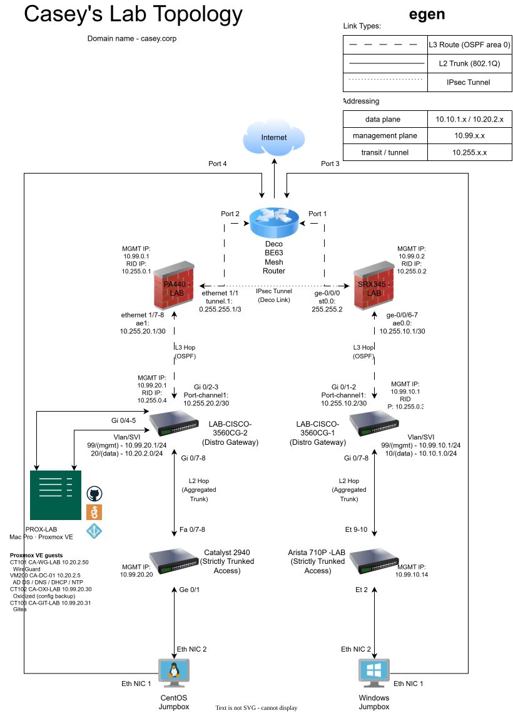

# CASEY-LAB — Dual-Site Enterprise Homelab

> **This is a living repository.** The lab is under active development — the
> topology diagram, this overview, and the project list evolve as the
> environment grows. Watch the commit history to see the build in motion.
>
> Part of a connected set: this hub · the
> [profile landing page](https://github.com/117caseyallen-NetAdm) · and each
> project repo below. All three are kept in sync as the lab changes.

A dual-site enterprise network built on real hardware — no GNS3, no EVE-NG.
Two firewalled sites joined into a single routing domain across a site-to-site
IPsec tunnel, with separated data and management planes, aggregated uplinks,
and a growing services layer. Domain: `casey.corp`.

*Diagram source: [`topology/CA-LAB-Topo.drawio`](topology/CA-LAB-Topo.drawio) —
updated as the lab changes.*

## Write-ups

| Document | What it covers |
|---|---|
| [Diagnosing a Failing SSD](docs/diagnosing-a-failing-ssd.md) | A "the VM is slow" complaint that took four days and two OS reinstalls to trace to an SSD whose **write path had failed while reads stayed at 367 MB/s** — and passed SMART the whole time. Ten hypotheses, each eliminated with a measurement. Includes a side finding on Apple hardware having no fan control under Linux. |

## What this lab demonstrates

| Capability | How it shows up here |
|---|---|
| **Multi-vendor fluency** | Four network OSes in one fabric: Palo Alto PAN-OS, Cisco IOS, Juniper Junos, Arista EOS — plus Proxmox/Debian on the compute side |
| **Dual-site routing design** | Flat OSPF area 0 unified across a route-based IKEv2 IPsec tunnel (PA-440 ⇄ SRX345); firewalls inject default routes as Type-5 LSAs |
| **Capability-matched link aggregation** | LACP where both ends speak it (SRX⇄3560CG, 3560CG⇄Arista), static EtherChannel where hardware predates it (Catalyst 2940) |
| **Plane separation** | Dedicated management VLAN/subnets (`10.99.x.x`) apart from data (`10.x.1.x` / `10.20.2.x`) and transit (`10.255.x.x`) — consistent addressing plan fleet-wide |
| **Resilient access design** | Dual-homed jumpboxes (one default gateway + static lab routes), redundant trunked access switches per site |
| **Real remote access** | Routed (non-NATed) WireGuard VPN with the client pool redistributed into OSPF — see the dedicated repo below |

## Architecture at a glance

- **WEST site:** PA-440 firewall → Cisco 3560CG distribution (VLAN 20 data,
  VLAN 99 mgmt) → Catalyst 2940 access, Proxmox VE host (2013 Mac Pro), CentOS
  jumpbox
- **EAST site:** SRX345 firewall → Cisco 3560CG distribution (VLAN 10 data,
  VLAN 99 mgmt) → Arista 710P access, Windows jumpbox
- **Inter-site:** route-based IPsec (IKEv2, AES-256-GCM, PFS), OSPF adjacency
  through the tunnel — one contiguous routing domain, MTU handled deliberately
  (1400 tunnel / 1380 for nested overlays)
- **Compute:** Proxmox VE with VLAN-aware bridging into the fabric trunk;
  services deployed as LXC containers and VMs (second node planned — cluster +
  quorum device)

## Projects

| Repo | Status | What it is |
|---|---|---|
| [homelab-wireguard](https://github.com/117caseyallen-NetAdm/homelab-wireguard) | ✅ Live | Routed WireGuard remote-access VPN: unprivileged LXC behind the PA-440, client pool redistributed into OSPF, reachable across the IPsec tunnel. Build notes + troubleshooting war stories included |
| *(this repo)* | 🔄 Evolving | Fabric overview and canonical topology |

## Roadmap

The goal is a complete, properly automated enterprise IT environment. In
dependency order, the build plan:

1. **Platform** — second Proxmox node, cluster + QDevice, Proxmox Backup Server
2. **Identity & core services** — Windows Server AD DS/DNS/DHCP for
   `casey.corp`, internal PKI (step-ca), 802.1X wired auth via RADIUS across
   all four switch vendors
3. **Network operations** — Oxidized config backup → self-hosted Git (Gitea),
   NetBox as source of truth, LibreNMS monitoring, centralized syslog
4. **Security operations** — SIEM ingesting firewall/host/network logs,
   Suricata IDS on a mirrored port, per-client VPN firewall policy,
   guest/IoT segmentation
5. **NetDevOps** — Batfish snapshot validation, Suzieq runtime state, and a CI
   pipeline: config change → PR → behavioral diff + compliance checks →
   automated deploy (Nornir/NAPALM) → post-change validation

Each phase ships with its own documented repo as it lands.

---

*All addressing shown is internal RFC1918 — that's deliberate. No credentials,
keys, public IPs, or DDNS hostnames appear in this repository.*
