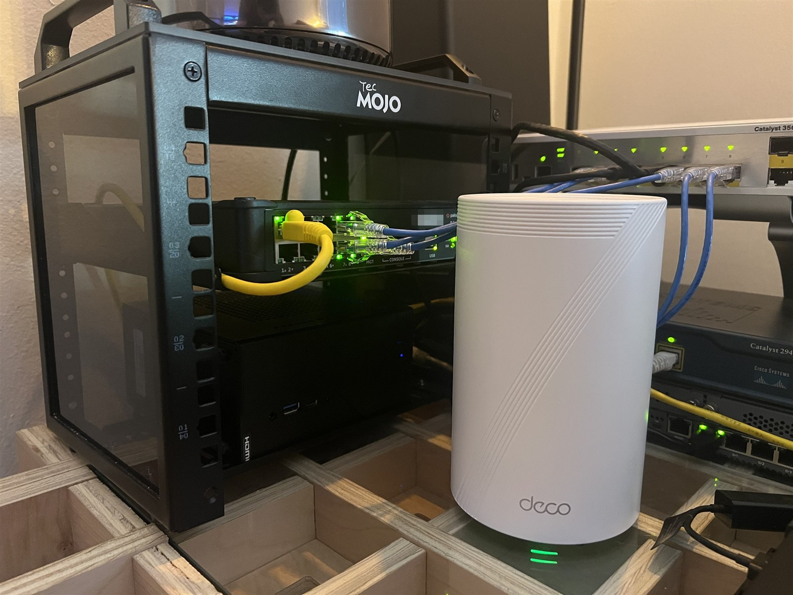

# CASEY-LAB — Dual-Site Multi-Vendor Homelab

Two firewalled sites on physical hardware, joined into one OSPF area 0 across a
route-based IKEv2 IPsec tunnel, with separated data and management planes,
aggregated uplinks, and a services layer that grows as I build it.

Both sites share one shelf and one internet uplink — the tunnel runs between the
firewalls' outside interfaces across the home router's LAN, which stands in for a
WAN. The routing and the vendor behaviour are real; the distance is not.

Domain: `casey.corp`. Services are added continuously and these documents track
the fabric as it changes — the commit history is the changelog.
[Profile](https://github.com/117caseyallen-NetAdm) · project repos below.

*Editable source: [`CA-LAB-Topo.drawio`](topology/CA-LAB-Topo.drawio) ·
scalable vector: [`CA-LAB-Topo.svg`](topology/CA-LAB-Topo.svg)*

## Projects

| Repo | What it covers |
|---|---|
| [homelab-tacacs-aaa](https://github.com/117caseyallen-NetAdm/homelab-tacacs-aaa) | Centralized device AAA: one `tac_plus-ng` server backed by AD, authenticating and authorizing all six devices across four vendors, with per-command accounting. The write-up covers why "fall back to local" meant three different things on four vendors, and five things that were configured correctly and didn't work |
| [homelab-config-backup](https://github.com/117caseyallen-NetAdm/homelab-config-backup) | Oxidized → Gitea for six devices and four vendor models; commits only on change, pushes unattended, now as a read-only TACACS+ service account. Runs from the management VLAN — the trade-off is under *Management access* below. The write-up covers why the three oldest switches needed no SSH workarounds and the newest one did |
| [homelab-domain-services](https://github.com/117caseyallen-NetAdm/homelab-domain-services) | AD DS, AD-integrated DNS with forward and reverse zones, DHCP with cross-site relay, time hierarchy, cross-site domain join |
| [homelab-wireguard](https://github.com/117caseyallen-NetAdm/homelab-wireguard) | Routed (non-NATed) WireGuard VPN, client pool redistributed into OSPF |

## Write-ups

| Document | What it covers |
|---|---|
| [Verification](docs/verification.md) | Live output for each claim on this page: OSPF adjacency across the tunnel, both default-route Type-5 LSAs, the VPN pool from origin route to far-site route table, IKE and IPsec SAs from both ends, LACP and static bundles, NTP. Captured 2026-09-13 |
| [Diagnosing a Failing SSD](docs/diagnosing-a-failing-ssd.md) | A "the VM is slow" complaint traced across four days and two OS reinstalls to an SSD whose write path had failed while reads ran at 1.1 GB/s, passing SMART throughout. Ten hypotheses, each eliminated with a measurement, plus a conclusion I got wrong and had to correct |

## Architecture

Physical hardware, not GNS3 or EVE-NG — a PA-440 and SRX345, two Catalyst
3560-CGs, a 2003 Catalyst 2940, an Arista 710P-12, and a 2013 Mac Pro running
Proxmox, all sharing one shelf.

| | |
|:--:|:--:|
|  |  |

### WEST
- **PA440-LAB** (Palo Alto PA-440) — WAN, WEST-LAN, and VPN zones. `ae1` LACP bundle down to the distribution switch on `10.255.20.0/30`. Terminates the IPsec tunnel on `tunnel.1`.
- **LAB-CISCO-3560CG-2** — distribution and gateway. VLAN 20 data, VLAN 99 management. `Port-channel1` up to the PA-440; static EtherChannel down to the Catalyst 2940.
- **C2940-LAB** — access. 2003-vintage Fast Ethernet; its IOS image has no LACP support, so the uplink is a static EtherChannel.
- **PROX-LAB** — Proxmox VE on a 2013 Mac Pro. VLAN-aware bridging into the fabric trunk; services run as LXC containers and VMs on two stacked bridges, one per plane:
  - on the data VLAN: **CA-DC-01** (AD DS, DNS, DHCP, and the fabric's NTP authority) and **CA-WG-LAB** (WireGuard)
  - on the management VLAN: **CA-OXI-LAB** (Oxidized config backup), **CA-GIT-LAB** (Gitea) and **CA-TAC-LAB** (TACACS+ and the log collector) — see *Management access* below for why they live there
  - every guest backed up nightly to a second physical machine over NFS, three generations kept, with a test restore to prove the archives work
- **CA-CENTOS-LAB** — dual-homed jumpbox.

### EAST
- **SRX345-LAB** (Juniper SRX345) — trust, untrust, and vpn zones. `ae0` LACP bundle on `10.255.10.0/30`. Terminates the tunnel on `st0.0`.
- **LAB-CISCO-3560CG-1** — distribution and gateway. VLAN 10 data, VLAN 99 management. LACP bundle to the Arista.
- **ARISTA710P-LAB** — access.
- **CA-WIN-LAB** — dual-homed jumpbox.

### Addressing

| Plane | Range |
|---|---|
| Data | `10.10.1.0/24` (EAST) · `10.20.2.0/24` (WEST) |
| Management | `10.99.x.x` — per-site /24s plus device loopbacks in `10.99.0.0/24` |
| Transit / tunnel | `10.255.x.x` — /30 point-to-point links and OSPF router IDs |
| VPN clients | `10.50.1.0/24`, redistributed into OSPF |

Management and transit follow a strict scheme. The two data subnets do not share
a third octet — an early inconsistency I kept rather than renumber a working
fabric.

## Management access

Access to network devices is restricted to the two jumpboxes and the management
plane. Nothing else, including the domain controller — a domain controller is
Tier 0, and access should not flow outward from it.

*Who* may log in is decided centrally. All six devices authenticate
administrators against Active Directory through TACACS+, map AD group membership
to privilege, and record every command on five of the six. The backup tool logs
in as a read-only service account. Each device keeps one local break-glass
account, tested over a console cable, for when the server can't be reached.
Detail in [homelab-tacacs-aaa](https://github.com/117caseyallen-NetAdm/homelab-tacacs-aaa).

Management *tooling* lives on the management plane itself. The config-backup and
Git containers sit in `10.99.20.0/24`, which the permit lists already include, so
they reached every device with no ACL changes across four syntaxes. The cost is
that the subnet is now a trust boundary: only management tooling is allowed on
it, and if that discipline slips the permit lists have to become host-based.
Detail in [homelab-config-backup](https://github.com/117caseyallen-NetAdm/homelab-config-backup#placement-management-vlan-no-acl-changes).

The same policy is enforced in four syntaxes:

| Vendor | Mechanism | Denial behaviour |
|---|---|---|
| Cisco IOS (modern) | Named ACL + `access-class` on vty | TCP reset — client sees "connection refused" |
| Cisco IOS 12.1 | Numbered ACL — sequence numbers unsupported on that release | TCP reset |
| Juniper Junos | `host-inbound-traffic` per zone, plus a `PROTECT-RE` filter on `lo0` | Silent discard — client sees a timeout |
| Palo Alto PAN-OS | Interface Management Profile with `permitted-ip` | Silent discard |

### Reaching the devices is its own problem

Four of the six won't accept a connection from a current OpenSSH client without
help, and for two different reasons:

| Devices | Offers | Client error | Needs |
|---|---|---|---|
| 3560CG-1, 3560CG-2 | SHA-1 key exchange only | `no matching key exchange method` | `KexAlgorithms +diffie-hellman-group14-sha1` |
| C2940 (2003) | **`diffie-hellman-group1-sha1` only** — RFC 2409, 1024-bit | same | `+diffie-hellman-group1-sha1`, `+3des-cbc` |
| PA-440 | modern key exchange, **`ssh-rsa` host key only** | `no matching host key type` | `HostKeyAlgorithms +ssh-rsa` |

The two errors name different halves of the handshake — how the session key is
derived, versus what the device proves its identity with — and telling them apart
saves configuring the wrong thing.

Worth knowing that this is **client policy, not a protocol limit**: the config
backup tool reaches all four with no configuration at all, because it speaks SSH
through a library that still implements those algorithms. Details in
[homelab-config-backup](https://github.com/117caseyallen-NetAdm/homelab-config-backup#ssh-what-failed-and-what-did-not).

### The management plane is a separate network

The PA-440 sources management services — NTP, DNS, syslog, updates and TACACS+
— from its dedicated MGT interface rather than the dataplane routing table. That port was uncabled here, so the firewall sat outside the NTP hierarchy
while answering SSH perfectly well in-band on its loopback: being reachable *on*
an interface does not make a box *send* from it.

A service route fixed it, and the MGT port is now cabled into VLAN 99 at
`10.99.20.2` so the whole category is retired rather than worked around — every
one of those services would otherwise have hit the same wall.

The [write-up](docs/verification.md#the-sixth-device-and-the-wrong-instrument)
covers the part that took an hour: `show ntp` reported failure long after the fix
had already worked, and the system log had said so the whole time.

## Roadmap

1. **Network operations** — ~~Oxidized config backup to self-hosted Git~~ ([done](https://github.com/117caseyallen-NetAdm/homelab-config-backup)), NetBox as source of truth, SNMPv3 across the fleet, monitoring (Telegraf → VictoriaMetrics → Grafana), centralized syslog (collector running; SIEM pending)
2. **AAA** — ~~TACACS+ for device administration backed by AD~~ ([done](https://github.com/117caseyallen-NetAdm/homelab-tacacs-aaa)), RADIUS for 802.1X, internal PKI so the directory lookups can move to LDAPS
3. **Security operations** — SIEM ingesting firewall and host logs, IDS on a mirrored port, guest/IoT segmentation
4. **NetDevOps** — Batfish snapshot validation and Suzieq runtime state in a CI pipeline: config change → PR → behavioural diff → automated deploy → post-change validation
5. **Platform** — ~~nightly off-node backups~~ (done), second and third Proxmox nodes, cluster with quorum device

---

*Internal RFC1918 addressing and hostnames are real. No credentials, keys, public
addresses, or device configurations appear in this repository.*
